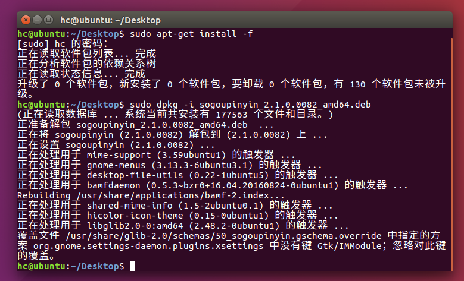
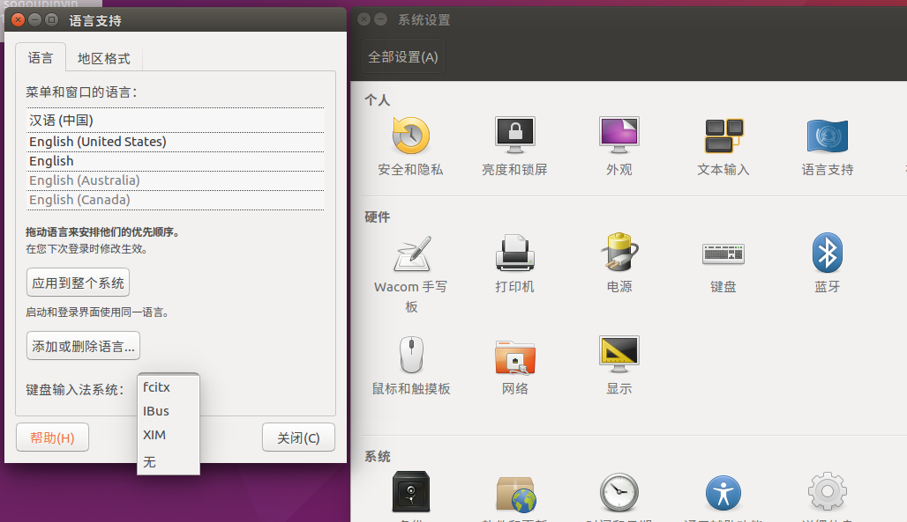
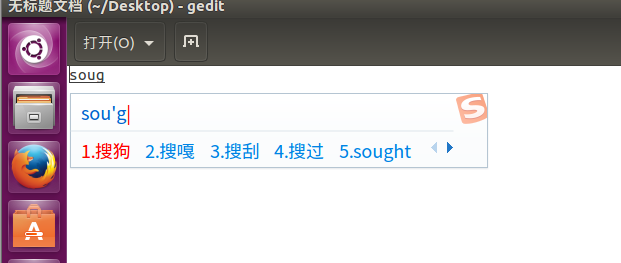

### 一、下载搜狗拼音
下载搜狗拼音的安装包方法挺多的,我是直接在主机下载好了,然后拖放到虚拟机里面去的[下载地址](http://pinyin.sogou.com/linux/?r=pinyin)，下载下来的文件名是"sogoupinyin_2.1.0.0082_amd64.deb",*.deb的后缀名在liunx系统,是跟.exe的文件一样,可以直接安装的。但是我点击安装后,提示说是，第三方的文件,可能包含危险程序.不然我安装。所以就要用命令的方式来安装咯.
### 二、安装
    cd /home/hc/Desktop --我的文件是放在了桌面
    sudo apt-get install -f 
    sudo dpkg -i sogoupinyin_2.1.0.0082_amd64.deb
等待安装...

### 三、设置输入法
到系统设置->语言支持（System->Language Support），将键盘输入法系统由默认的iBus设置为fcitx。如下图：

### 四、重启

